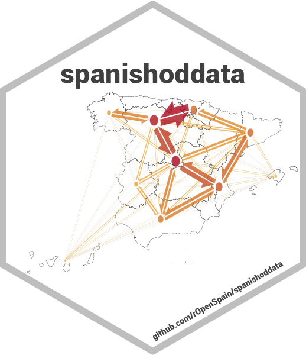
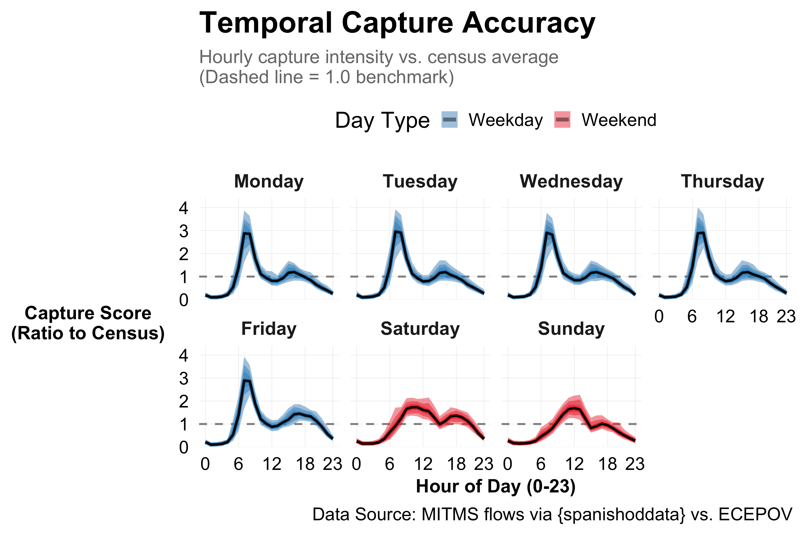
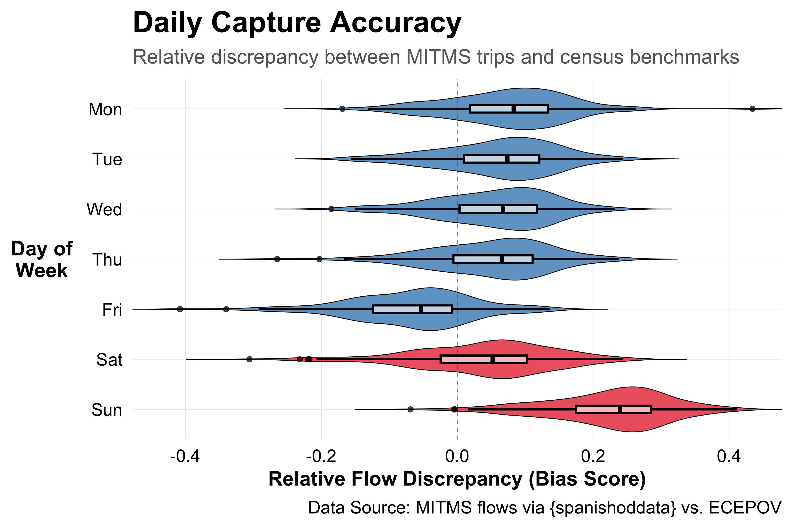
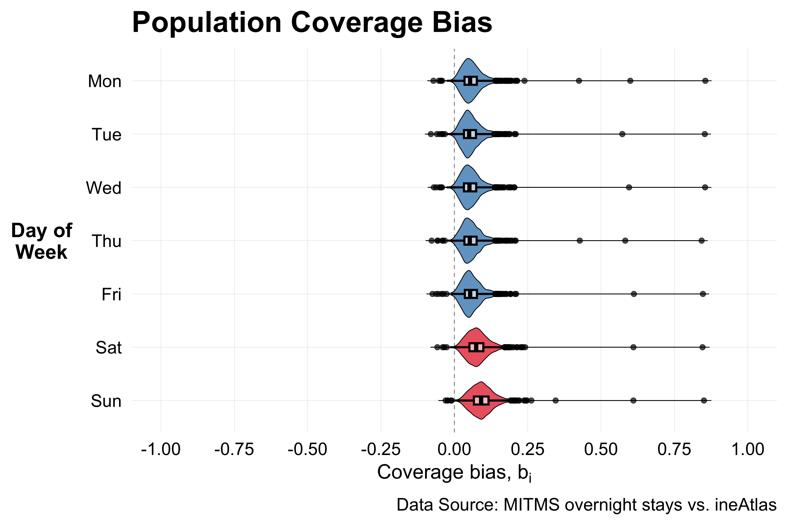

## Data and Methods {vertical-align="center"}

```{=html}
<div style="text-align: center;">
<br>
<div style="display: grid; grid-template-columns: repeat(4, 1fr); gap: 10px; width: 100%; align-items: start;">
  <div style="padding: 5px; margin: 0 5px;">
    
    <div style="font-weight: bold; margin-bottom: 2px; font-size: 0.85em;">Mobility Data</div>
    <div style="font-size: 0.65em; font-family: monospace; color: #566573;">{spanishoddata}</div>
  </div>

  <div style="padding: 5px; margin: 0 5px;">
    
    <div style="font-weight: bold; margin-bottom: 2px; font-size: 0.85em;">Census Commuting</div>
    <div style="font-size: 0.65em; font-family: monospace; color: #566573;">{ineapir}</div>
  </div>

  <div style="padding: 5px; margin: 0 5px;">
    
    <div style="font-weight: bold; margin-bottom: 2px; font-size: 0.85em;">Population Benchmark</div>
    <div style="font-size: 0.65em; font-family: monospace; color: #566573;">{ineAtlas}</div>
  </div>

  <div style="padding: 5px; margin: 0 5px;">
    
    <div style="font-weight: bold; margin-bottom: 2px; font-size: 0.85em;">Bias Measurement</div>
    <div style="font-size: 0.65em; font-family: monospace; color: #566573;">{debiasR}</div>
  </div>
</div>
</div>
```

## [Entire Country]{.glass-box} {background-color="black" background-image="media/spain-folding-flows.gif" background-size="contain"}

## [5 years of hourly OD matrices]{.glass-box} {background-color="black" background-image="media/barcelona-time.gif" background-size="contain"}

## Results

<!-- ## Hourly Bias (March 2023)

{#fig-hourly fig-align="center"} -->

## Daily Bias (March 2023)

{#fig-daily fig-align="center"}

## Population Coverage (March 2023)

{#fig-pop fig-align="center"}
