## Data and Methods {vertical-align="center"}

```{=html}
<div style="text-align: center;">
<br>
<div style="display: grid; grid-template-columns: repeat(4, 1fr); gap: 10px; width: 100%; align-items: start;">
  <div style="padding: 5px; margin: 0 5px;">
    
    <div style="font-weight: bold; margin-bottom: 2px; font-size: 0.85em;">Mobility Data</div>
    <div style="font-size: 0.65em; font-family: monospace; color: #566573;">{spanishoddata}</div>
  </div>

  <div style="padding: 5px; margin: 0 5px;">
    
    <div style="font-weight: bold; margin-bottom: 2px; font-size: 0.85em;">Census Commuting</div>
    <div style="font-size: 0.65em; font-family: monospace; color: #566573;">{ineapir}</div>
  </div>

  <div style="padding: 5px; margin: 0 5px;">
    
    <div style="font-weight: bold; margin-bottom: 2px; font-size: 0.85em;">Population Benchmark and Covariates</div>
    <div style="font-size: 0.65em; font-family: monospace; color: #566573;">{ineAtlas}</div>
  </div>

  <div style="padding: 5px; margin: 0 5px;">
    
    <div style="font-weight: bold; margin-bottom: 2px; font-size: 0.85em;">Bias measurement & adjustment</div>
    <div style="font-size: 0.65em; font-family: monospace; color: #566573;">{debiasR}</div>
  </div>
</div>
</div>
```

## [Entire Country]{.glass-box} {background-color="black" background-image="media/spain-folding-flows.gif" background-size="contain"}

## [5 years of hourly OD matrices]{.glass-box} {background-color="black" background-image="media/barcelona-time.gif" background-size="contain"}

## Census data

### Origin based commuting data only, 1% sample


<br>

::: {style="font-size: 0.75em;"}
| Origin Municipality | Official INE Code | Destination | Total Commuters (Outflow) |
| :--- | :--- | :---: | :---: |
| **Motril** | `18140` | <span style="color: #888;">*Unknown*</span> | 26,180 |
| **Torrelavega** | `39088` | <span style="color: #888;">*Unknown*</span> | 22,380 |
| **Aranjuez** | `28013` | <span style="color: #888;">*Unknown*</span> | 27,307 |
| **Santa Lucía de Tirajana** | `35022` | <span style="color: #888;">*Unknown*</span> | 35,019 |
:::


# Results

## Population Coverage Bias

{fig-align="center"}


## Coverage Bias by Area Population

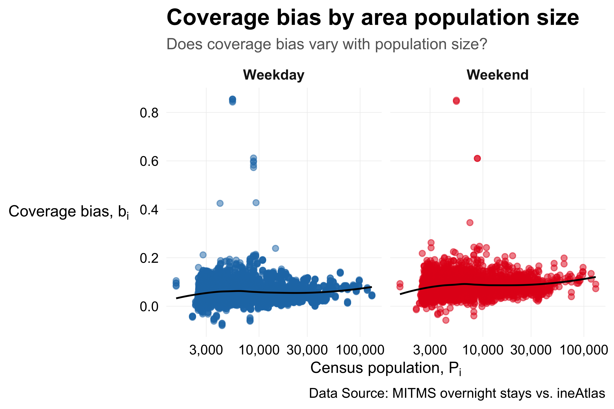{fig-align="center"}

<!-- 
## Coverage Bias Outliers — Weekdays

### Areas with |median $b_i$| > 0.3

{fig-align="center"}


## Coverage Bias Outliers — Weekends

### Areas with |median $b_i$| > 0.3

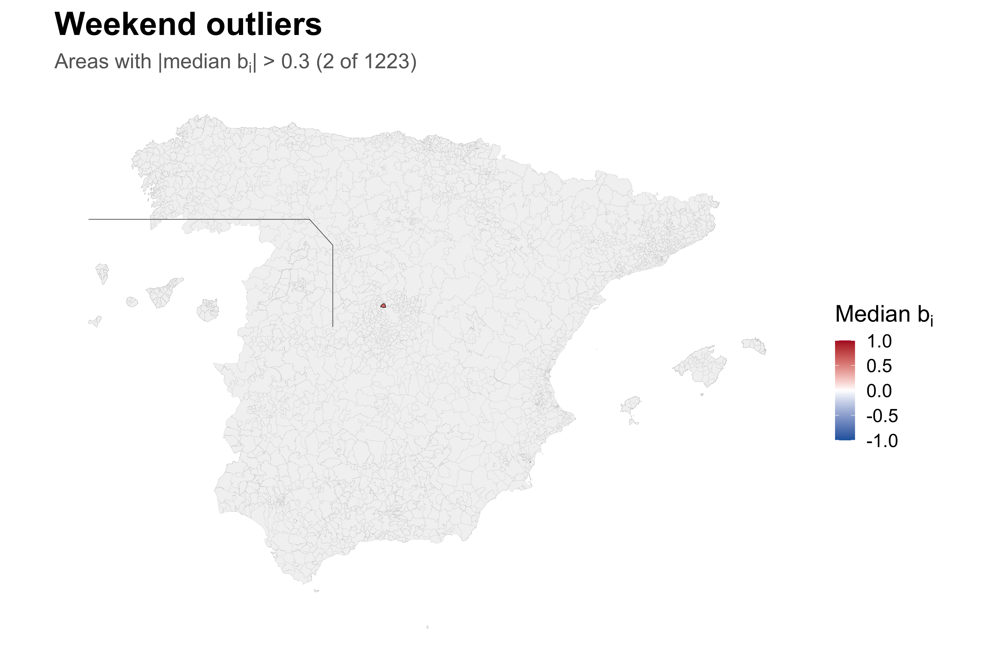{fig-align="center"} -->


## Daily Flow Coverage Ratio

### 🏠 home → 💼🎓 work/study + 🛒 frequent + 🎭 infrequent

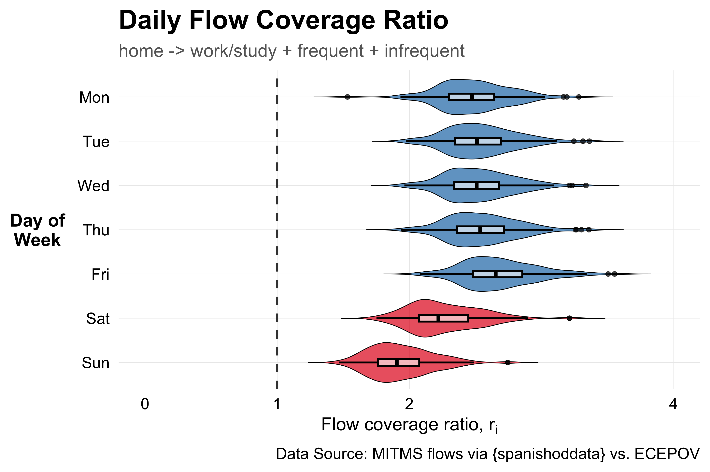{fig-align="center"}


## Daily Flow Coverage Ratio

### 🏠 home → 💼🎓 work/study

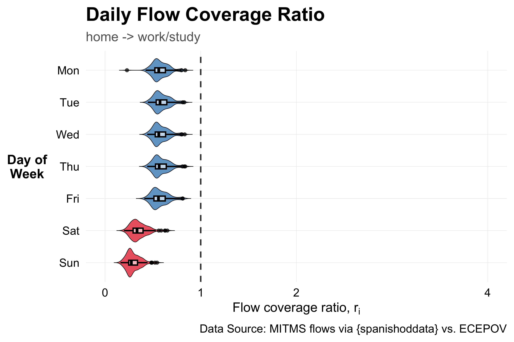{fig-align="center"}


## Daily Flow Coverage Ratio

### 🏠 home → 💼🎓 work/study + 🎭 infrequent

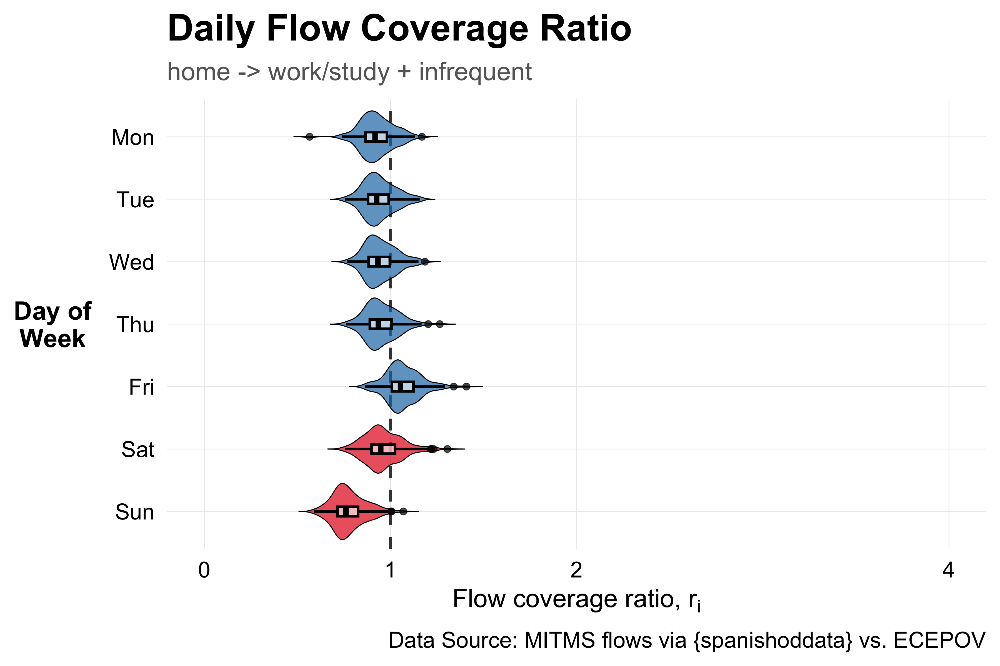{fig-align="center"}

## Flow Coverage Ratio by Activity Filters

### 💼🎓 work/study only

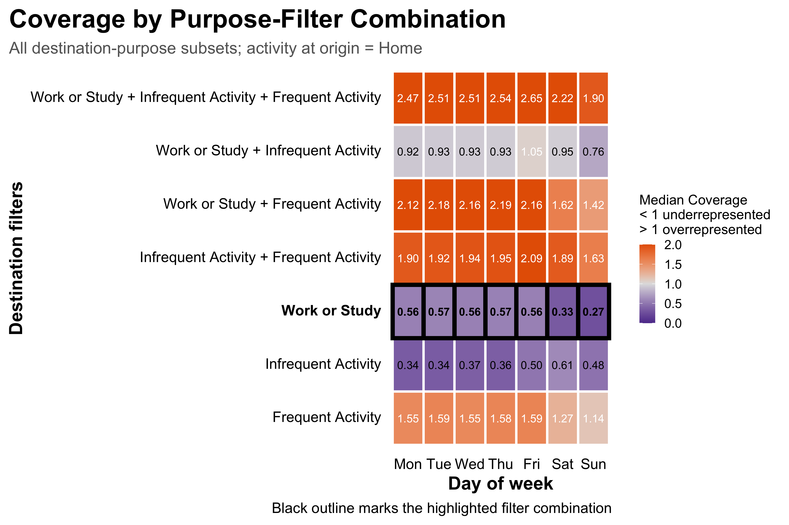{fig-align="center"}

## Flow Coverage Ratio by Activity Filters

### 💼🎓 work/study + 🛒 frequent

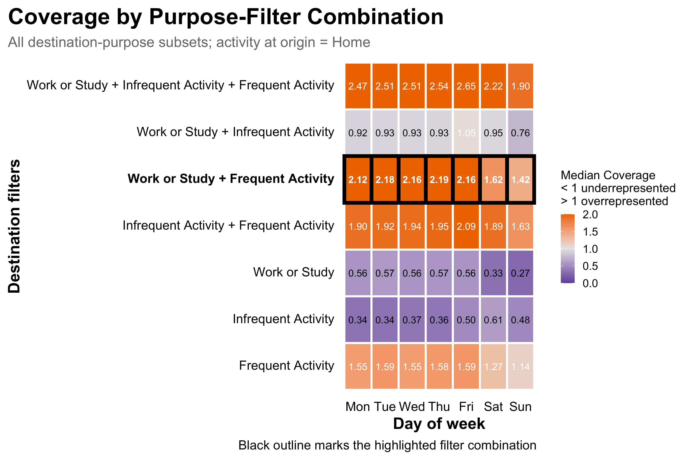{fig-align="center"}

## Flow Coverage Ratio by Activity Filters

### Best match: 💼🎓 work/study + 🎭 infrequent

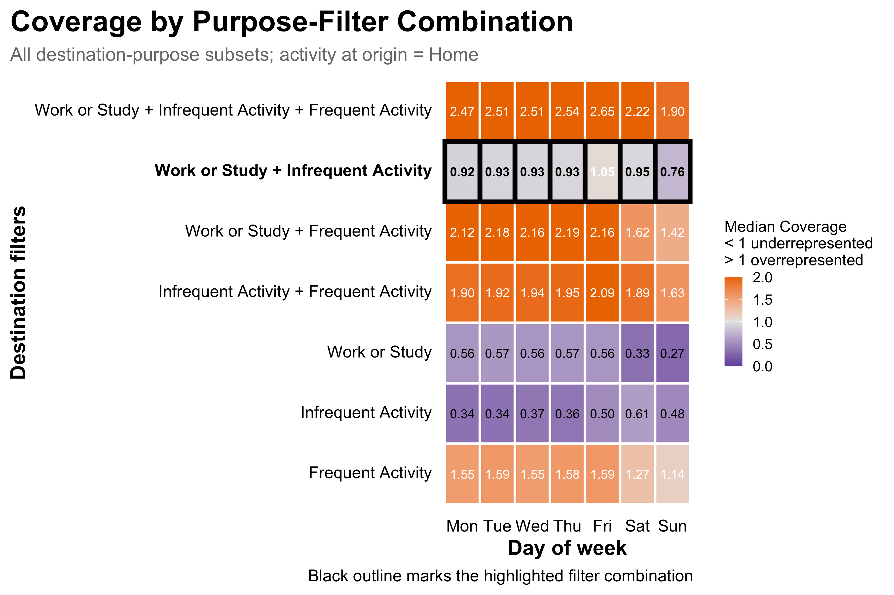{fig-align="center"}

## Standardized User-Count Residuals

### debiasR Level-2 marginal validation

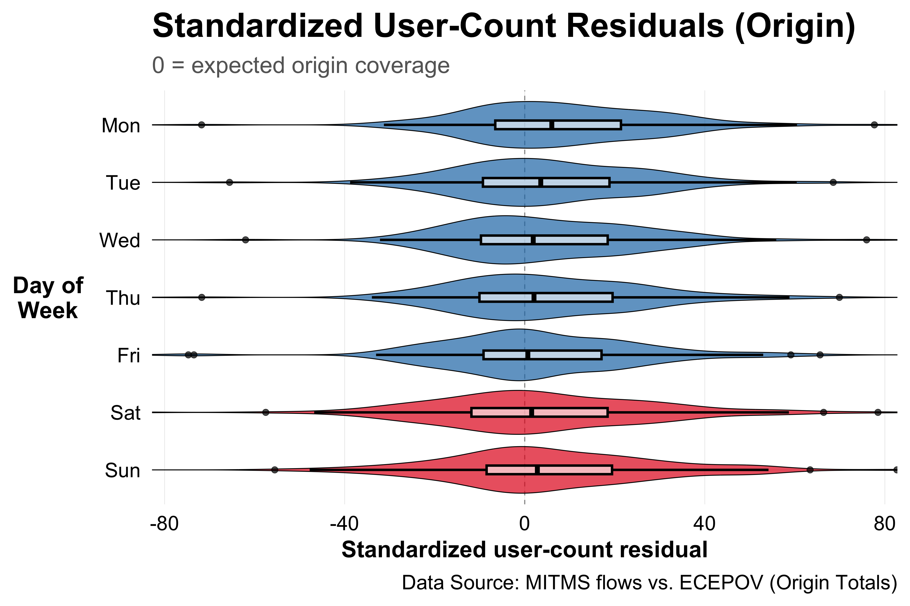{fig-align="center"}

## Bias Adjustment Performance

### Origin-marginal fit only

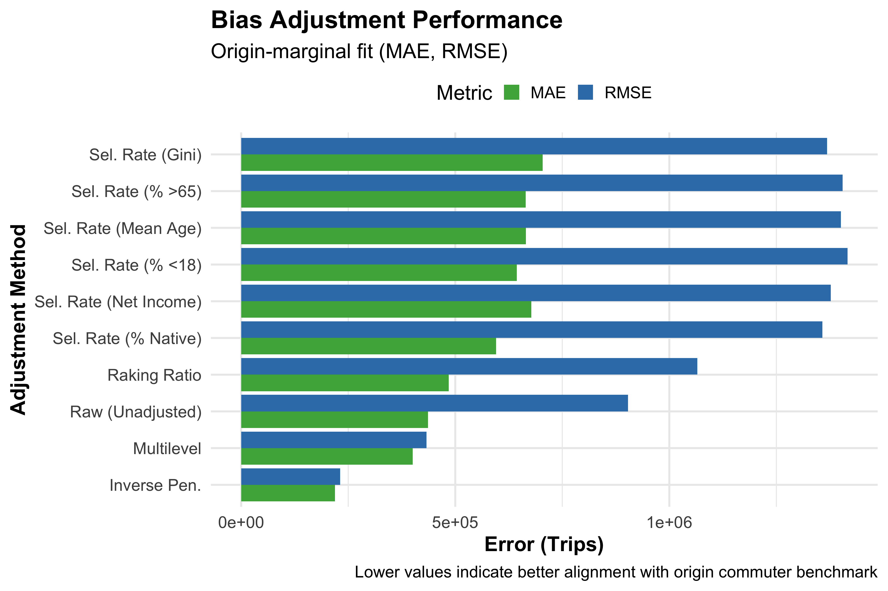{fig-align="center"}

<!-- ## Origin Marginal Validation

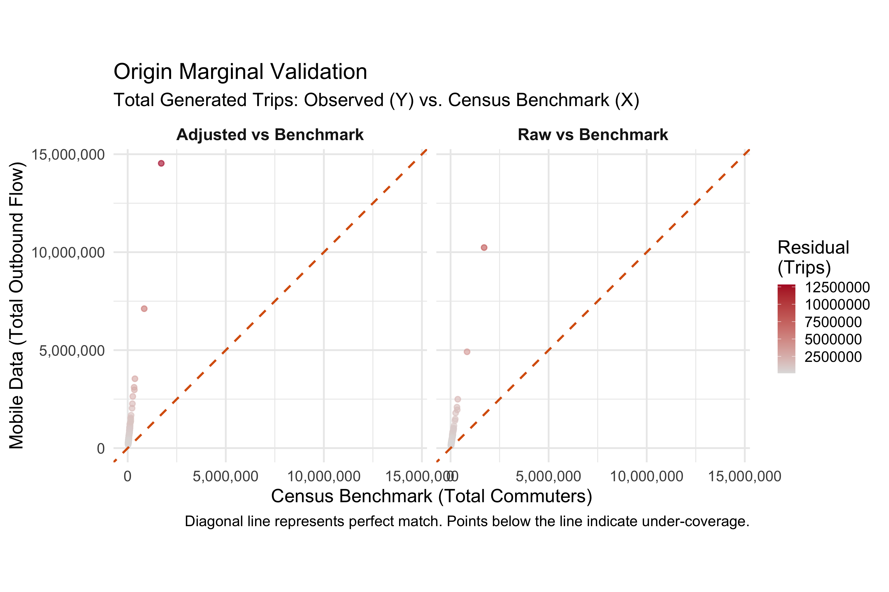{fig-align="center"} -->
<!-- 
## Origin-Marginal Residual Heatmap (Level 3 Validation)

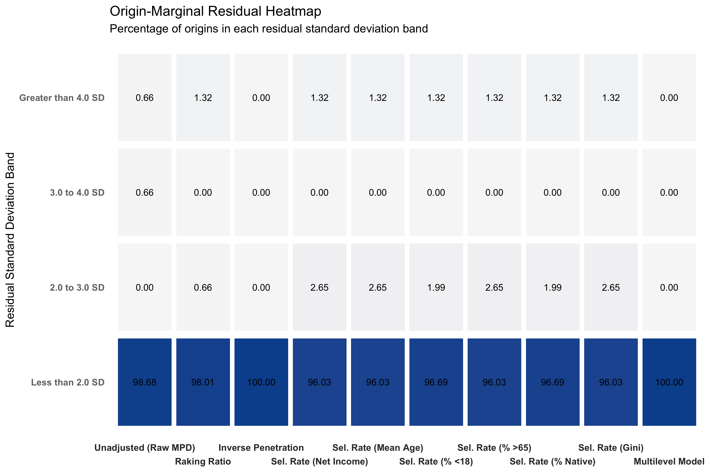{fig-align="center" height="500px"} -->

## Origin-Marginal Residuals

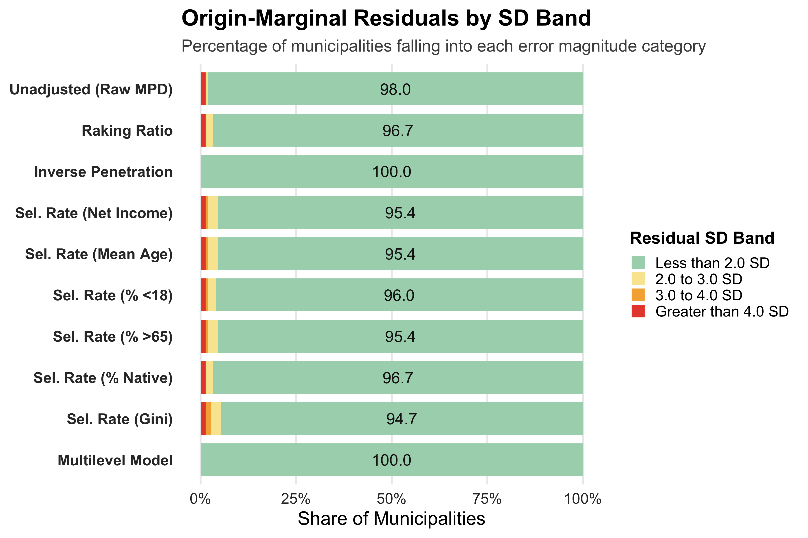{fig-align="center" height="500px"}

## Origin-Marginal Residuals

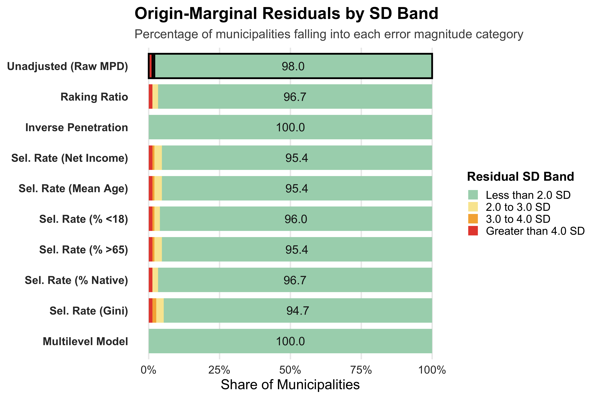{fig-align="center" height="500px"}

## Origin-Marginal Residuals

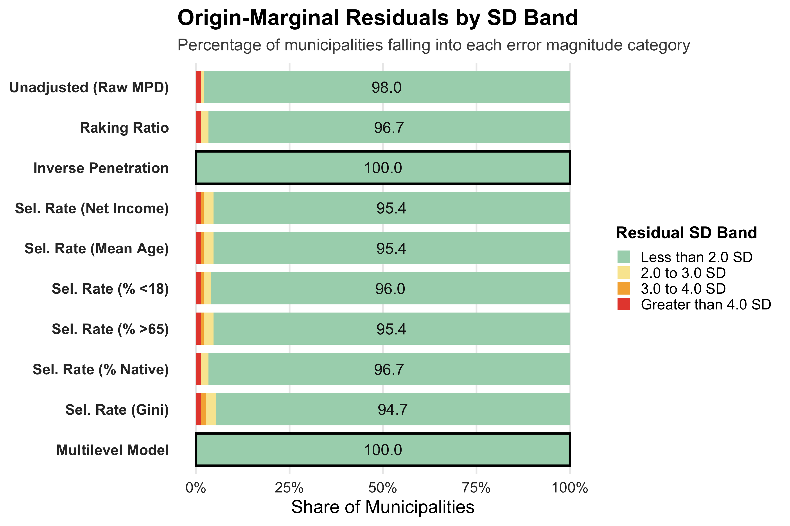{fig-align="center" height="500px"}
